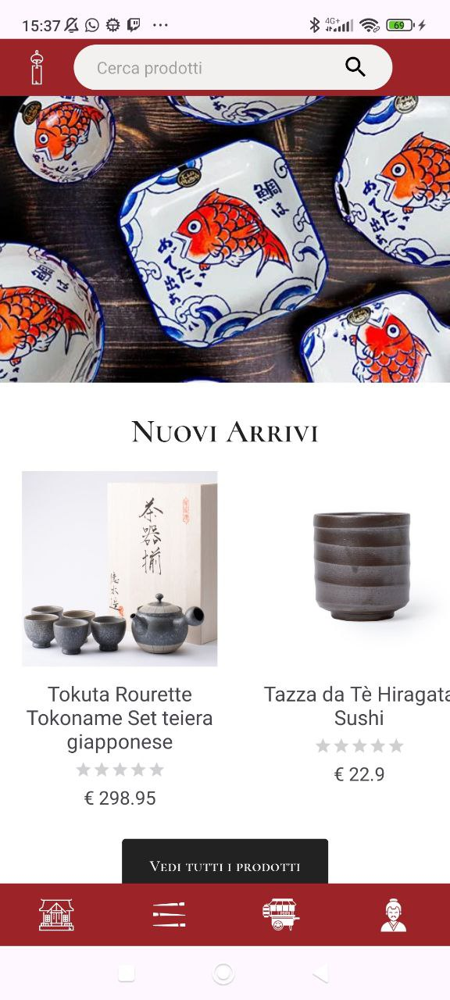
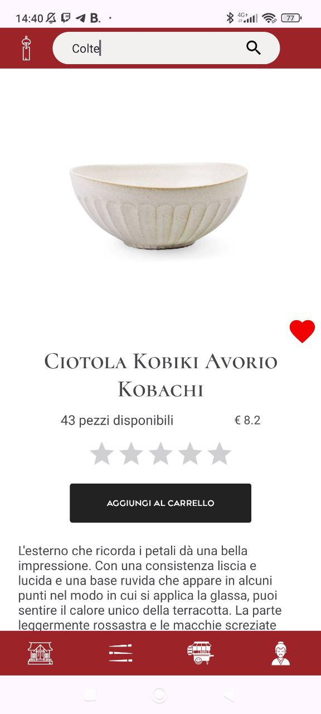
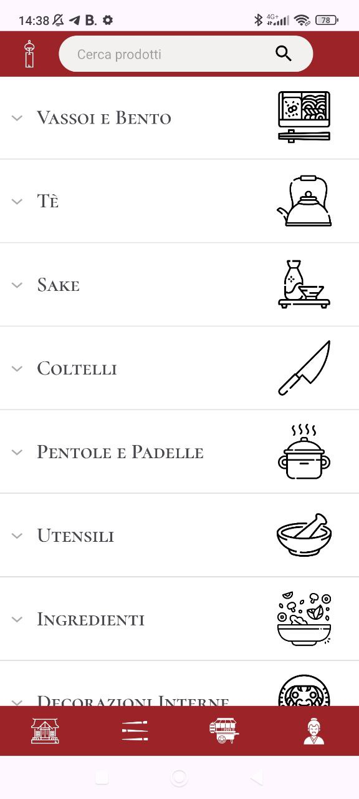
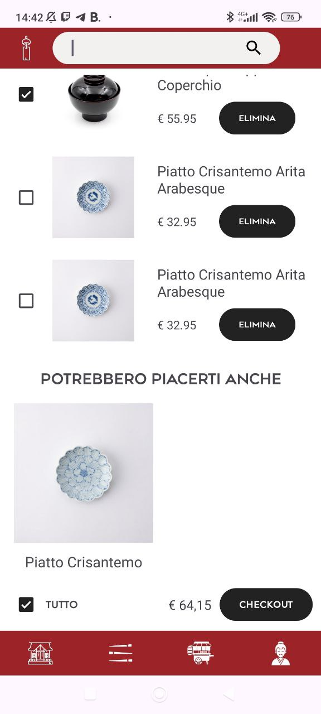
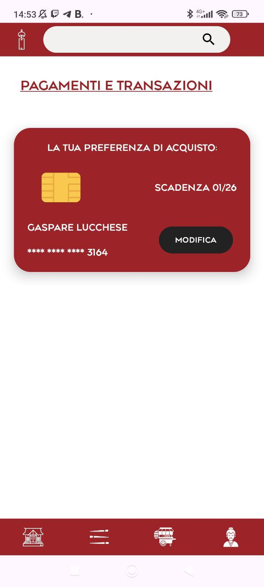
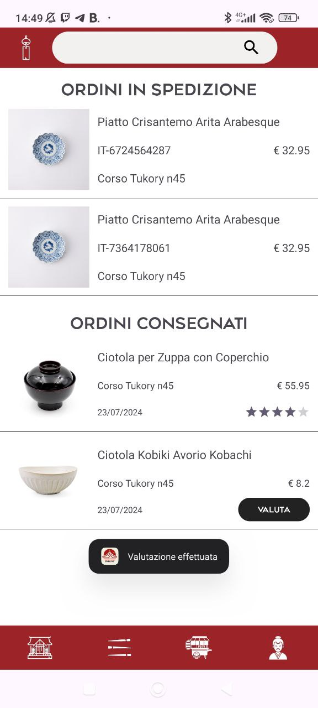
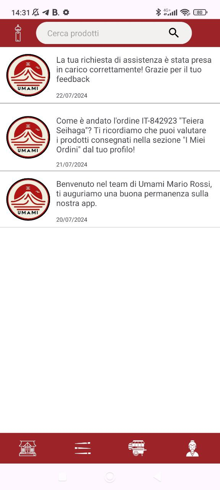

# 🍣 Umami - Japanese Tableware E-Commerce App

**Umami** is a modern **e-commerce Android app** specializing in **Japanese tableware**.  
Developed in **Kotlin** with **Android Studio**, it allows users to explore and purchase authentic **Japanese dishes, bowls, teacups, and more**.  

The app is powered by a **Flask (Python) backend** connected to a **MySQL database**, with **Retrofit** managing network communication.

## 🚀 Features
- 🔐 **User Authentication**: Registration, login, and profile management.  
- 🔄 **Session Management**: Persistent login using SharedPreferences.  
- 🛍️ **Shopping Experience**:
  - Browse a curated selection of **Japanese tableware**.  
  - Add products to the shopping cart.  
  - Manage delivery details and payment options.  
- 💬 **Customer Support & Feedback**: Users can contact support and leave reviews.  
- ⭐ **Product Reviews**: Customers can rate and review purchased items.  
- 🧠 **Personalized Recommendations**:  
  - Suggestions based on cart contents.  
  - Special sections for promotions, new arrivals, and restocked items.  
  - Smart recommendations based on past purchases.  
- 🔎 **Product Discovery**:  
  - Search bar and category filters for **plates, bowls, teacups, chopsticks, and more**.  
  - Highlighted deals on the homepage.  
- 📦 **Order Tracking & Notifications**: Users can monitor their purchases and receive updates.  

## 🖼️ Screenshots

### 🏠 Home Page

### 📄 Product Details

### 🗂️ Product Categories

### 🛒 Shopping Cart

### 💳 Payment Details

### 📜 Orders & Order Ratings

### 🔔 Notifications

## 🛠️ Technologies Used
- **Languages**: Kotlin, Python, XML, SQL  
- **Architecture**: MVVM (Model-View-ViewModel)  
- **Libraries**: Flask, Retrofit, Glide, Gson  
- **Database**: MySQL 
